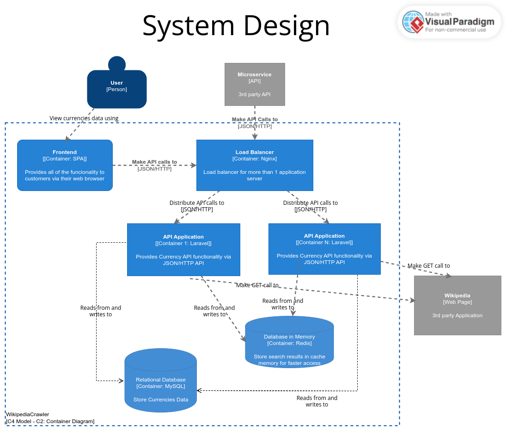

<h2 align="center">
     Desafio Logcomex
</h2>

## 🚀 Tecnologias

Esse projeto foi desenvolvido com as seguintes tecnologias:

- [PHP 8.3](https://php.net)
- [Laravel 11](https://laravel.com)
- [Xdebug](https://xdebug.org/)
- [Docker](https://docker.com)
- [Nginx](https://nginx.org/en/)
- [MySQL 5.7](https://mysql.com)
- [Redis](https://redis.io)
- [Swagger](https://swagger.io/)


## 📑 Projeto

Esse projeto é uma uma aplicação que faz o crawling de dados de moedas em uma fonte externa e retorna seus dados.  
O(s) termo(s) de pesquisa poderão ser um código ou número ISO 4217 (padrão internacional que define códigos de três letras para as moedas).  

Para melhorar a performance da API, foi implementado o recurso de Load Balancer através no Nginx. Tal recurso permitirá 
o balanceamento de carga entre N instâncias da aplicação.  
O recurso de Cache também está presente, contribuindo para reduzir o tempo de resposta das requisições, deixando a 
aplicação mais performática.  

## 📐 Arquitetura


### 🔎 Como funciona a pesquisa?  
Cache | Bando de Dados | Crawler  
1- Cache -> Primeiramente verifica no Cache se tem os dados da pesquisa. Se tiver, os devolve;  
2- Bando de Dados -> Se não tiver no Cache, busca no Banco de Dados. Encontrou? Salva no Cache e devolve.  
3- Crawler -> E se não tiver nem no Cache e nem no Banco de Dados, faz o Crawler e filtra no resultado o termo pesquisado. 
Se encontrou, salva no banco de dados e no Cache e devolve o resultado. Caso contrário retorna mensagem de "Not found".

Caso tenha uma busca por um array de códigos ou números, a aplicação segue conforme descrito acima e, caso algum ou 
alguns dos códigos/números já estejam presentes no Banco de dados, o Crawler é feito pra buscar somente os 
dados das moedas que ainda não estão salvas no banco.  

**OBS.:** conforme requisito, a tabela de dados da fonte não é salva por inteiro no banco de dados. Os dados são salvos 
por demanda, ou seja, por pesquisa feita.  

Para este projeto o Crawling será feito na página [ISO 4217](https://pt.wikipedia.org/wiki/ISO_4217) do Wikipedia.

## ⚙️ Instalação e execução

## 1- Clonar o Projeto e Criar Rede Externa do Docker
### Passo a passo
Clonar o Repositório
```sh
git clone https://github.com/thiagoluna/crawler-php-docker-cache-load-balance
```

Criar o Arquivo .env
```sh
cp .env.example .env
```

Subir os containers do projeto
```sh
docker-compose up -d
```

Acessar o container
```sh
docker-compose exec crawler1 bash
```

Instalar as dependências do projeto
```sh
composer install
```

Criar as tabelas
```sh
php artisan migrate
```

## 💻 Acessar a Aplicação
Como se trata de uma API RESTful, acessar os endpoints através do Postman ou outro API Client. 
- Fazer a pesquisa - http://localhost:8990/api/v1/currencies (POST)
  - Payload: {"code": "GBP"} ou {"code_list": ["GBP", "GEL"] } ou {"number": [242]} ou {"number_lists": [242, 324]} 
  - Validação de entrada de dados na aplicação feita através do FormRequest

A documentação no Swagger apresenta detalhes desse endpoint.

## 📝 Documentação - http://localhost:8990/api/documentation
A documentação que descreve a API RESTful desenvolvida neste projeto pode ser acessada em http://localhost:8990/api/documentation  
Esta documentação foi produzida utilizando o Swagger e apresenta em detalhes esse Endpoint, podendo inclusive consumí-lo
diretamente pela documentação para fazer alguma requisição. 

## 🚀 Funcionalidades do Laravel usadas nesta aplicação
- Migrations, Factories, Seeders, FormRequest, Mutators, Cache, Jobs, Helpers.

## 🗃️ Base de dados
- MySQL
- Eloquent ORM para trabalhar com uma base de dados, onde as tabelas têm um "Modelo" correspondente que se utiliza para interagir com essa tabela.

## 📔 Design Pattern
- **Repository Design Pattern** para separar o acesso aos dados (Repositories) da lógica de negócios (Service Layers).  
  Com este padrão temos uma divisão de responsabilidades, deixando cada camada da aplicação o mais simples possível,
  contribuindo para a aplicação ser escalável mais facilmente.
- Foi utilizado o conceito de **DTO** para facilitar o transporte de dados encapsulando os dados primitivos como objetos.
- E também o conceito de **Service Layer** apresentado pelo Martin Fowler, onde "cada camada estabelece um conjunto de 
  operações disponíveis e coordena a resposta do aplicativo em cada operação". 

**OBS.:** Também foi utilizado neste projeto os princípios do SOLID, Object Calisthenics e DRY.

## 👨‍👩‍👧‍👦 Load Balance
Para melhorar a performance da API, foi implementado o recurso de Load Balancer através no Nginx. Tal recurso permitirá
o balanceamento de carga entre N instâncias da aplicação.  
Para este projeto, o docker foi configurado para subir 2 instâncias exatamente iguais do container da aplicação, facilitando
a escalabilidade conforme a necessidade.

## 🎯 Testes Automatizados
Os testes cobrem toda a jornada de pesquisa de moedas.      
Ex.:
- Testes do DTO
- Testes dos Enums
- Testes do FormRequest
- Testes do Job
- Testes do Controller
- Testes dos Services de Crawler e Currency
- Testes dos Logs
- Testes do Repository

Para executar os testes, execute un dos comandos abaixo dentro da pasta do projeto:
```sh
docker-compose exec Crawler1 vendor/bin/phpunit
docker-compose exec Crawler1 php artisan test
```

## 🛠️ Tratamento de Erros
Cada tipo de erro tem uma Exception específica, que quando lançada é sempre capturada no Controller, que gera um log e 
devolve uma mensagem personalizada para a requisição feita.  
Os logs serão registrados no arquivo laravel.log, seguindo o padrão do Larevel, e poderão ser enviados via Slack para 
um grupo, onde o monitoramento dos erros será bem mais efetivo.  

Pensando em performance, todo log será gerado a partir do disparo de um Job que executa a ação de regtistrá-lo de forma 
assíncrona.  

## 🙋‍♂️ Desenvolvido por 
Thiago Luna: [Linkedin!](https://www.linkedin.com/in/thiago-luna/)

## Algumas Skills


[](https://git-scm.com/doc)
[](https://docs.github.com/)
